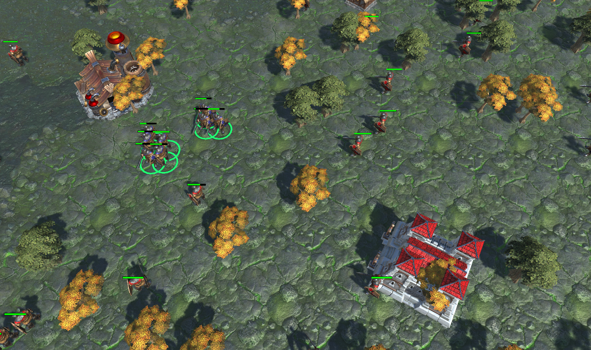

<h1 align="center"> War3: Keystone Edition </h1>

  
  
A war3 battle simulator powered by the Keystone ecs engine

---

Keystone is a rollup framework in development that powers high performance onchain games, allowing developers to build the types of real-time games like Age of Empires, while combining EVM smart contracts for its composability.

In this release, we're showcasing the on-going entity-component-system based engine that will power the bulk of the game logic in keystone sequencers. The client is built in Unity.

Some features we're excited to bring alive:

- EVM execution: keystone will interoperate between its ecs engine and evm through precompiles
- Visual ECS editors
- Advanced event based service between client (eg. Unity) and the rollup state
- Smart contracts that will secure the Keystone architecture

Made with <3,
Curio
