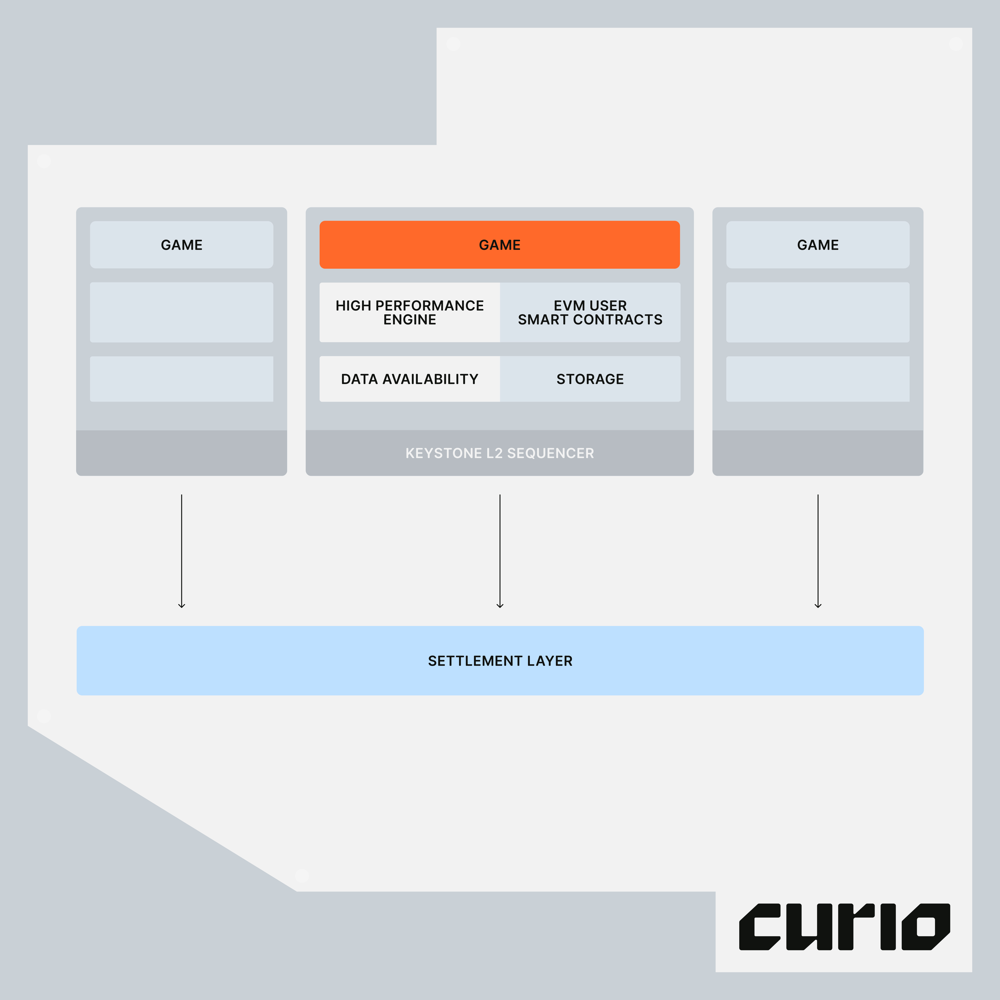

# Overview

Keystone includes:

- **State management**: Table-based schemas cleanly organize data, inspired by the ECS model.
- **Game Server**: A high tick-rate server pushes the game forward (100+ ticks per second), executing **systems** written in Go
- **Plugins**: Bring your own data availability plugins, state backup solutions.

What’s coming soon:

- Keystone EVM: A smart contract layer that composes with the core game data
- Better code-gen support across platforms (Unity, Typescript, etc)
- UI state explorers, simulation tools
- Parallel execution ???



## Write games in Go

```jsx
// weather automatically changes
func weatherSystem(ctx *server.TransactionCtx[any]) {
	game := GameSchema.Get(ctx.W, constants.GameEntity)

	// change weather
	if game.Weather == data.Sunny {
		game.Weather = data.Windy
	} else {
		game.Weather = data.Sunny
	}

	data.Game.Set(ctx.W, constants.GameEntity, game)
}

var WeatherSystem = server.CreateGeneralSystem(weatherSystem)
```

Previously, games written in Solidity and other languages were problematic in many ways:

- **Performance**: Games running 100% in the EVM, even if one runs their own dedicated rollup, is bottlenecked by performance when dealing with many complex transactions and concurrent players.
- **Testing and debugging**: It’s quite annoying to write comprehensive tests and use proper debuggers.

Generally, Solidity isn’t a performant or convenient language to write, test, and debug game logic.

With Keystone, write game logic in Go to enjoy a more convenient way to build your games with much higher performance, supporting 10s of thousands of transactions per second. Use any existing Go library at your disposal.

## Game loop automatically execute systems

Since smart contracts cannot automatically execute and schedule transactions ahead of time, games have relied on lazy updating and UI to “predict the outcome” of a transaction in the future.

All systems in Keystone can run on an interval. Think health regeneration every second, automatically harvest crops, changing weather conditions.

Some systems, like health regeneration and crop harvesting, can be triggered automatically.

```jsx
ctx.AddSystem(1000, systems.WeatherSystem);
```

Some other systems are also responsible for parsing user requests and processing them, such as player movement, swinging a sword, jumping.

```jsx
type FireProjectileRequest struct {
	Direction helper.Direction `json:"direction"`
	PlayerId  int              `json:"playerId"`
}

var FireProjectionSystem = server.CreateSystemFromRequestHandler(func(ctx *server.TransactionCtx[FireProjectileRequest]) {
	req := ctx.Req.Data
	w := ctx.W

	direction := req.Direction
	initialPosition, found := locationOfPlayer(w, req.PlayerId)
	if !found {
		return
	}

...
```

Clients send a request to the Keystone server in a standard Keystone transaction format, with a `FireProjectileRequest` as the data type.
